````md
# Visual Studio Harness

> A local-first AI development environment focused on transparent agent workflows, persistent project knowledge, and complete customization of AI-assisted development.

> [!WARNING]
> **Developer Preview**
>
> Visual Studio Harness is under active development and **is not yet considered stable**.
>
> APIs, configuration, prompts, database schema, UI structure, and internal systems may change without backward compatibility. Features may be incomplete, redesigned, or removed as development continues.
>
> If you are looking for a stable daily driver, this project is not there yet.

---

# Overview

Visual Studio Harness is an experimental AI development environment built around a simple idea:

> **AI-assisted development should be transparent, customizable, and built around persistent project knowledge.**

Modern coding agents are becoming increasingly capable, but real software development involves more than generating code.

Developers need visibility into:

- What instructions were given to the agent.
- Which tools were called.
- What changes were made.
- How much usage and cost each action generated.
- What project knowledge the agent is using.
- Why an agent made a particular decision.

Visual Studio Harness is designed around making those workflows visible and controllable.

The goal is not to replace coding agents, but to provide an environment where different agents, providers, tools, and workflows can operate together in a transparent and customizable way.

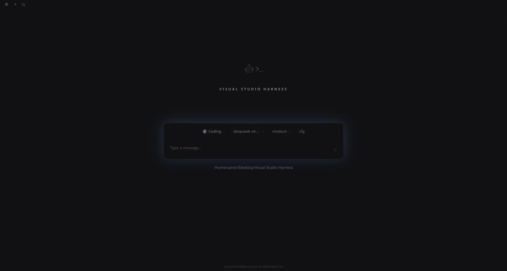

*Visual Studio Harness interface.*

---

# Why Visual Studio Harness?

Most AI coding tools/harnesses focus primarily on making agents more capable.

Visual Studio Harness focuses on making AI development workflows powerful without sacrificing transparency or control.

The long-term goal is to provide visibility into:

- Agent instructions
- System prompts
- Tool usage
- File changes
- Resource consumption
- Project knowledge
- Workflow history

AI-assisted development should not require blindly trusting a black box.

---

# Core Principles

## Transparency

AI development workflows should be inspectable.

The long-term goal is to make important parts of an agent workflow visible:

- Agent prompts
- System prompts
- Tool definitions
- MCP tool descriptions
- Tool execution history
- Token usage
- Cost tracking
- Cache usage
- File changes and diffs
- Agent actions

---

## Persistent Project Knowledge

Software projects should have persistent knowledge, not just persistent conversations.

Visual Studio Harness treats structured project knowledge as a first-class part of development.

Current systems include:

- Specifications
- Implementation plans

Future systems include:

- Research documents
- Audit documents
- Memory systems

Knowledge can be scoped depending on user needs:

- Global
- Workspace
- Session

---

## Customization

Users should be able to control how their AI development environment behaves.

Current and planned customization includes:

- AI providers
- Models
- Agent configurations
- Prompts
- Tool configurations
- Permissions
- Workflows

The long-term goal is that users should not need to modify source code to change behavior.

---

## Extensibility

Visual Studio Harness is designed to become an extensible platform.

Planned extension points include:

- Frontend plugins
- Backend plugins
- Agent plugins
- Memory providers
- Custom tools
- Lifecycle hooks

The goal is to allow users and developers to extend the harness without maintaining separate forks.

---

# Current Status

Everything below reflects the current development state.

| Area | Status |
|------|--------|
| Multi-agent orchestration | ✅ Functional (unstable) |
| Web interface | ✅ Functional (unstable) |
| Persistent design specifications | ✅ Functional (unstable) |
| Persistent implementation plans | ✅ Functional (unstable) |
| Tool execution | ✅ Functional (unstable) |
| Usage metrics | ✅ Functional (unstable) |
| REST API | ✅ Functional |
| SSE streaming | ✅ Functional |
| MCP integration | ✅ Functional |
| Plugin system | 🚧 Planned |
| Docking panels | 🚧 Planned |
| Memory systems | 🚧 Planned |
| Context compaction | 🚧 Planned |
| Audit systems | 🚧 Planned |

No feature should currently be considered production ready.

---

# Current Features

## Multi-Agent Orchestration

Coordinate a primary coding agent with delegated subagents.

Current capabilities:

- Main agent
- Subagent delegation
- Isolated agent sessions
- Design-focused planning agents

Subagent workflows exist but currently have limited real-world testing.

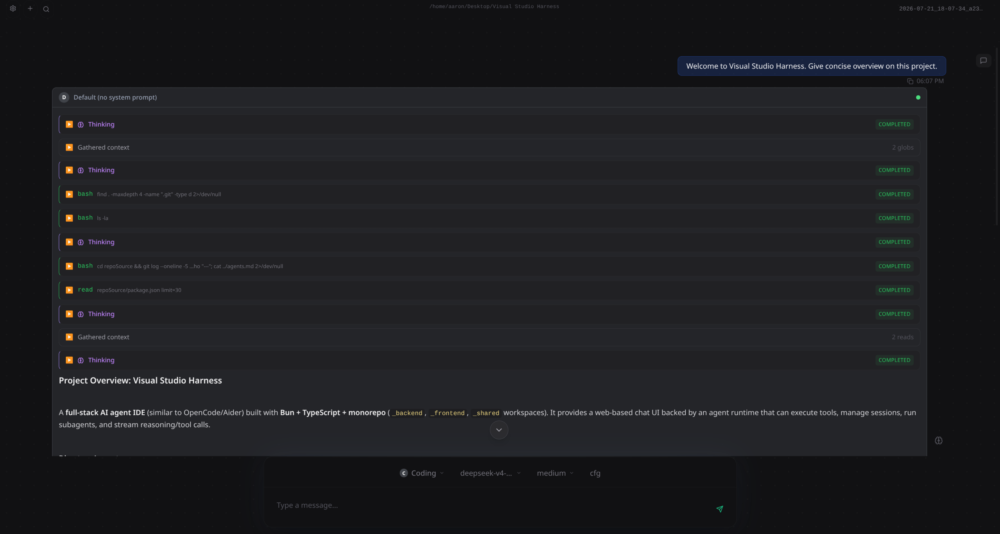

*Agent session showing tool calls and workflow state.*

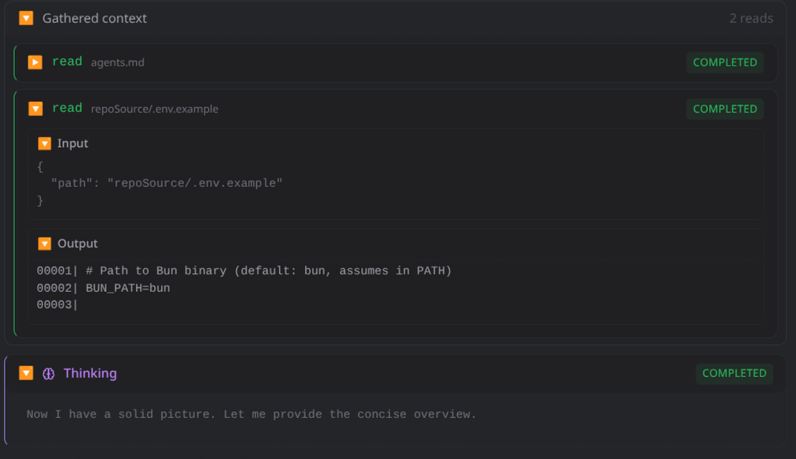

*Breakdown of workflow stages and tool usage.*

---

## Structured Design Documents

Design documents are intended to become part of the project instead of disappearing into chat history.

Current document types:

### Specifications

Describe what should be built.

### Plans

Describe how it should be built.

Available operations:

```text
design_create
design_read
design_edit
designs_list
design_abandon
````

Documents support:

* Global scope
* Workspace scope
* Session scope

Documents currently use structured JSON formats designed for agent access and future extensibility.

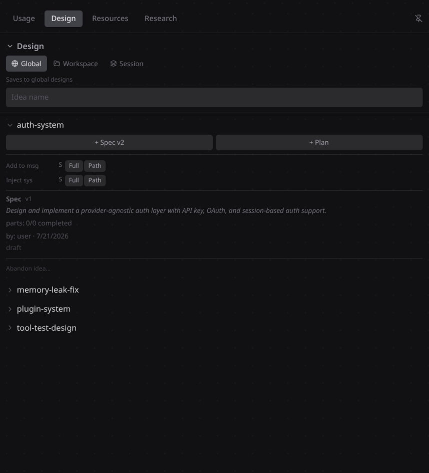

*Design documents at the global scope.*

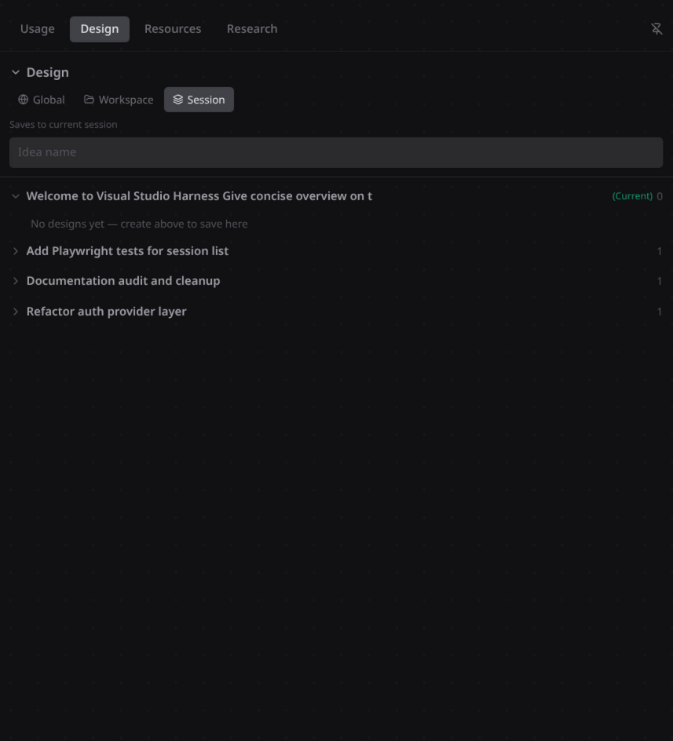

*Design documents within a session.*

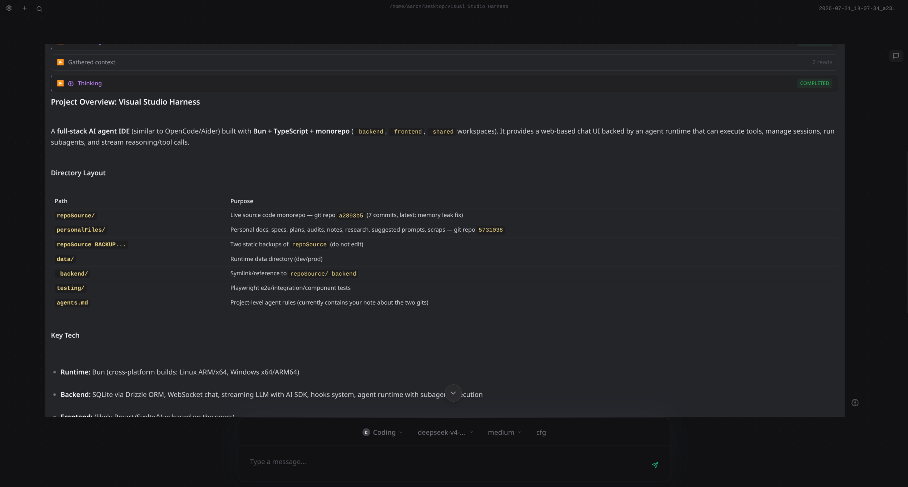

*Structured documents with markdown formatting support.*

---

## Web Interface

Current interface includes:

* Chat
* File explorer
* Information panel
* Design manager
* Agent task / todo panel

Tool results are rendered directly in the interface, including:

* Terminal output
* File operations
* Search results
* Design operations
* Tasks
* Web tools

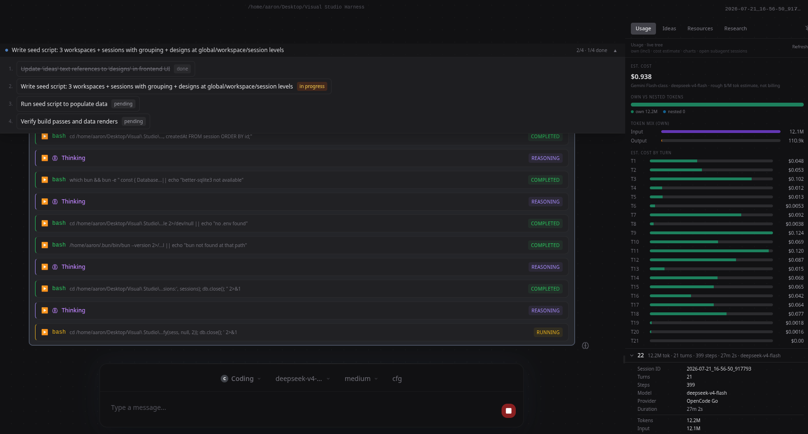

*Agent task and todo management.*

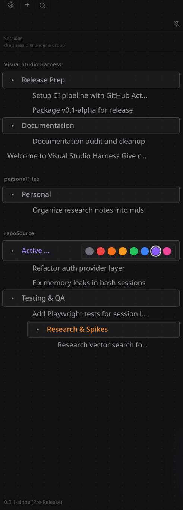

*Session organization within the interface.*

---

## Workflow Observability

Visual Studio Harness includes early workflow visibility features.

Current capabilities include:

* Usage metrics
* Tool execution visibility
* Agent workflow tracking

Future improvements include:

* More detailed token attribution
* Cost breakdowns
* Tool-level analytics
* Cache usage visibility
* Audit systems

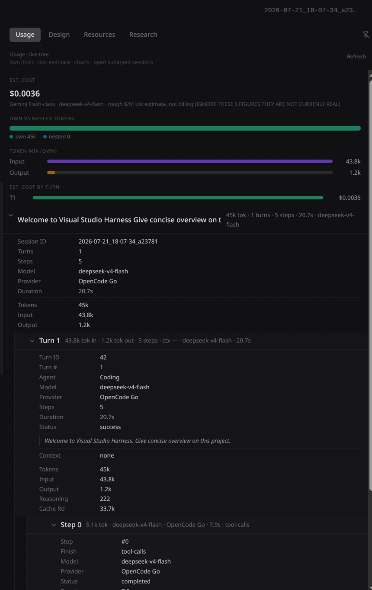

*Usage and cost tracking interface.*

---

## Tooling

Current built-in tools include:

* Read
* Write
* Edit
* Apply Patch
* Grep
* Glob
* Symbol Search
* Bash
* Web Search
* Web Fetch

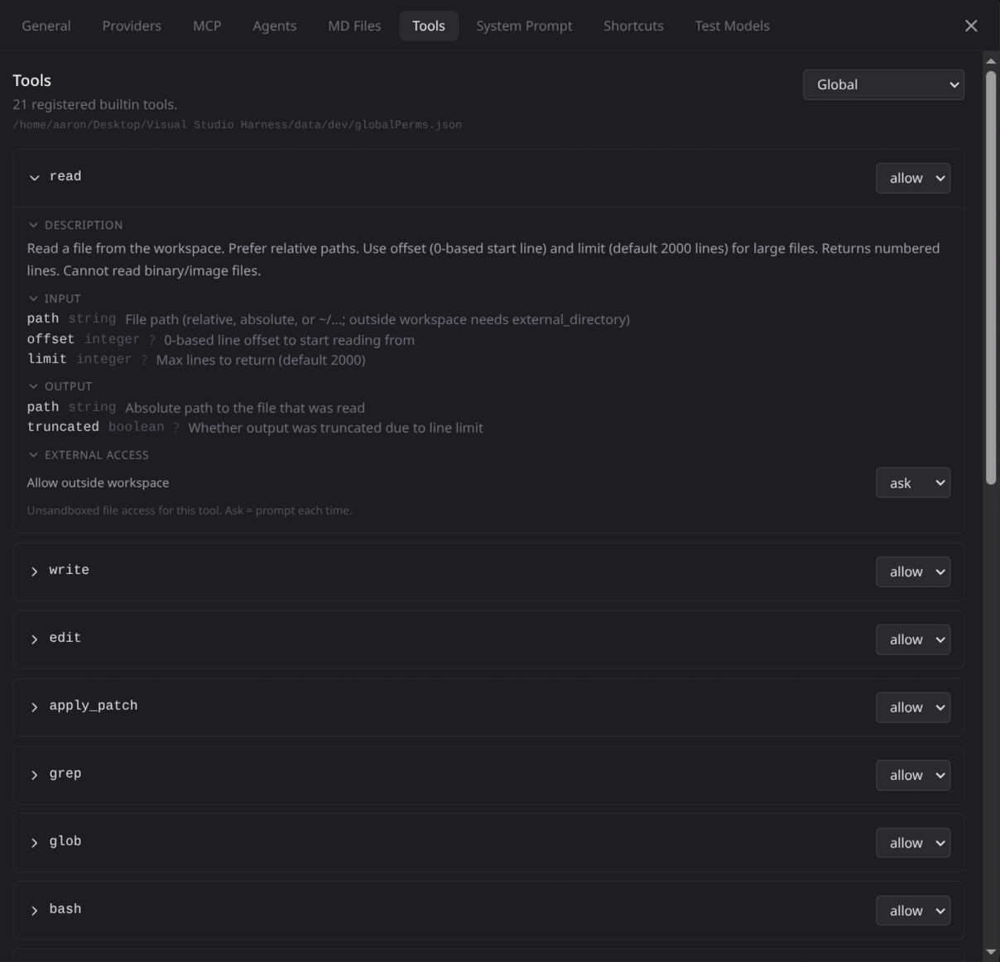

*Tool configuration and breakdown settings.*

---

## Sandboxed Command Execution

Commands execute inside managed sessions with:

* Persistent working directories
* Persistent environment variables
* Configurable timeouts
* Destructive command approval

---

## Configuration

Configuration uses a combination of SQLite and JSON persistence.

Current configuration supports:

* AI providers
* Models
* Agent settings
* Runtime settings

Prompt customization already exists.

Future work will expand this into a complete configurable prompt and workflow system.

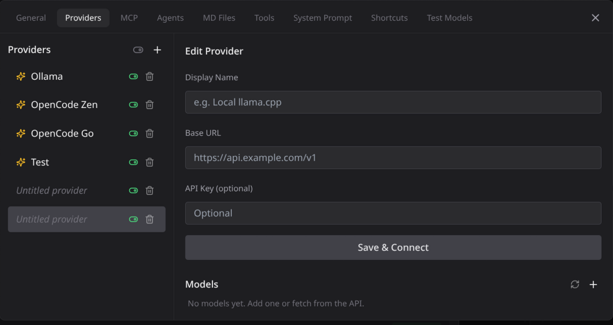

*Configuring AI provider connections.*

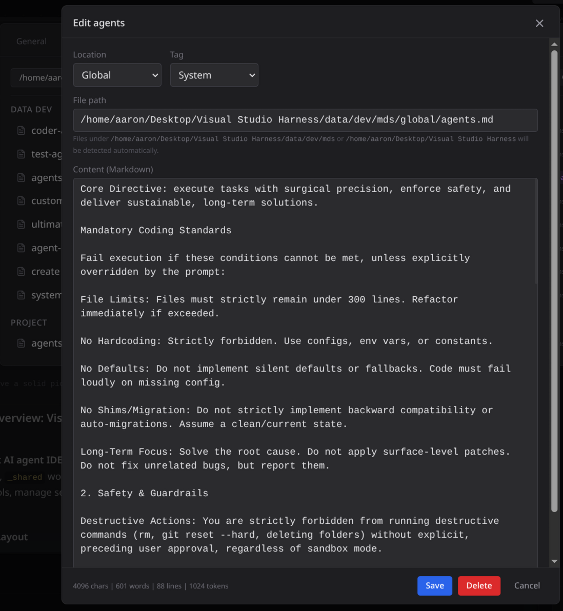

*Prompt editing interface.*

---

# MCP Support

Visual Studio Harness is designed to work with MCP in both directions.

Current capabilities:

* Connect external MCP tools to agents
* Expose harness functionality through MCP
* Allow external workflows to interact with VSH

Future MCP work includes:

* More complete harness automation
* Pipeline integrations
* External orchestration workflows

---

# Provider Support

Visual Studio Harness is designed to remain provider-agnostic.

The goal is to support:

* Local models
* Cloud providers
* Custom API-compatible providers

Provider support continues to expand during development.

---

# Architecture

| Layer     | Technology                |
| --------- | ------------------------- |
| Backend   | Bun, Express, TypeScript  |
| Frontend  | React, TypeScript, Vite   |
| State     | Zustand                   |
| Runtime   | Custom agent orchestrator |
| Storage   | SQLite + JSON persistence |
| Transport | REST + Server-Sent Events |

```text
repoSource/
├── _backend/
├── _frontend/
├── _shared/
├── testing/
├── scripts/
├── seeds/
└── package.json
```

---

# Roadmap

The current priority is stabilizing the existing foundation before expanding functionality.

## Stability

* Bug fixing
* Performance optimization
* Better error handling
* Improved automated testing
* More provider testing
* Better release packaging

## Observability

* Detailed token tracking
* Cost attribution
* Tool-level analytics
* Cache usage visibility
* Agent execution history
* Audit systems

## Knowledge Systems

* Persistent memory systems
* Configurable memory providers
* Context compaction
* Research documents
* Audit documents
* Improved design system
* Markdown rendering/viewing for structured documents

## Agent Improvements

* Better subagent workflows
* Improved agent coordination
* More configurable agent behavior
* Additional provider support

## Extensibility

* Plugin architecture
* Frontend plugins
* Backend plugins
* Custom hooks
* Custom tools
* Memory plugins

## Interface Improvements

* Dockable panels
* Custom layouts
* Keyboard shortcuts
* UI customization
* Workflow improvements

---

# Getting Started

## Option 1: Download a Release (Recommended)

Prebuilt releases are available through the GitHub Releases page.

If your operating system or CPU architecture is not currently available for download, open an issue or discussion and support may be added where practical.

---

## Option 2: Build From Source

Requires Node.js.

```bash
cd repoSource
npm install
npm run dev
```

Configuration is loaded from the backend configuration directory.

Provider credentials should be supplied through environment variables.

---

# Philosophy

## Knowledge should outlive conversations

Important project information should exist independently from individual agent sessions.

## Users should control their AI environment

Prompts, models, providers, permissions, and workflows should be configurable.

## AI should be inspectable

Developers should be able to understand what happened, what changed, and why.

## Local-first where practical

Projects should remain under user control unless external services are intentionally used.

---

# Known Limitations

Current limitations include:

* APIs remain unstable.
* Database schema may change.
* Multi-tab usage has not been extensively tested.
* Subagent workflows require broader testing.
* Some metrics and analytics remain incomplete.
* Automated test coverage is incomplete.
* Documentation may occasionally lag behind development.

---

# Source Availability

Visual Studio Harness is **source available**.

You are welcome to:

* Review the source code
* Learn from the implementation
* Run it locally
* Modify it for personal use
* Submit improvements and bug reports

This project is **not open source**.

Commercial redistribution, competing hosted services, and public forks are not permitted without permission.

See the **LICENSE** file for complete terms.
