# Visual Studio Harness

> A local-first AI development environment focused on transparent agent workflows, persistent project knowledge, and complete customization of AI-assisted development.

> [!WARNING]
> **Developer Preview**
>
> Visual Studio Harness is under active development and **is not yet considered stable**.
>
> APIs, configuration, prompts, database schema, UI structure, and internal systems may change without backward compatibility. Features may be incomplete, redesigned, or removed as development continues.
>
> If you are looking for a stable daily driver, this project is not there yet.

---

# Overview

Visual Studio Harness is an experimental AI development environment built around a simple idea:

> **AI-assisted development should be transparent, customizable, and built around persistent project knowledge.**

Modern coding agents are becoming increasingly capable, but real software development involves more than generating code.

Developers need visibility into:

- What instructions were given to the agent.
- Which tools were called.
- What changes were made.
- How much usage and cost each action generated.
- What project knowledge the agent is using.
- Why an agent made a particular decision.

And developers need overview and atomic control over:

- **Agents** — Multi-agent orchestration, delegation, slot gating, runtime settings
- **Tools** — Permissions (global, per-session, per-tool), execution, custom tool definitions
- **Knowledge** — MDS documents, knowledge base, context windows, research, audits

Visual Studio Harness is designed around making those workflows visible and controllable.

The goal is not to replace coding agents, but to provide an environment where different agents, providers, tools, and workflows can operate together in a transparent and customizable way.

---

# Why Visual Studio Harness?

Most AI coding tools/harnesses focus primarily on making agents more capable.

Visual Studio Harness focuses on making AI development workflows powerful without sacrificing transparency or control.

The long-term goal is to provide visibility into:

- Agent instructions
- System prompts
- Tool usage
- File changes
- Resource consumption
- Project knowledge
- Workflow history

AI-assisted development should not require blindly trusting a black box.

---

# Core Principles

## Transparency

AI development workflows should be inspectable.

The long-term goal is to make important parts of an agent workflow visible:

- Agent prompts
- System prompts
- Tool definitions
- MCP tool descriptions
- Tool execution history
- Token usage
- Cost tracking
- Cache usage
- File changes and diffs
- Agent actions

---

## Persistent Project Knowledge

Software projects should have persistent knowledge, not just persistent conversations.

Visual Studio Harness treats structured project knowledge as a first-class part of development.

Current systems include:

- Specifications
- Implementation plans
- Research documents
- Audit documents
- Knowledge base with semantic search
- MDS (Markdown Document System) for structured docs

Future systems include:

- Memory systems
- Configurable memory providers

Knowledge can be scoped depending on user needs:

- Global
- Workspace
- Session

---

## Customization

Users should be able to control how their AI development environment behaves.

Current and planned customization includes:

- AI providers
- Models
- Agent configurations
- Prompts (including per-step system prompts)
- Tool configurations
- Permissions
- Workflows
- Hooks
- MCP servers

The long-term goal is that users should not need to modify source code to change behavior.

---

## Extensibility

Visual Studio Harness is designed to become an extensible platform.

Planned extension points include:

- Frontend plugins
- Backend plugins
- Agent plugins
- Memory providers
- Custom tools
- Lifecycle hooks

The goal is to allow users and developers to extend the harness without maintaining separate forks.

---

# Current Status

Everything below reflects the current development state.

| Area | Status |
|------|--------|
| Multi-agent orchestration | ✅ Functional (unstable) |
| Web interface | ✅ Functional (unstable) |
| Persistent design specifications | ✅ Functional (unstable) |
| Persistent implementation plans | ✅ Functional (unstable) |
| Tool execution | ✅ Functional (unstable) |
| Usage metrics | ✅ Functional (unstable) |
| REST API | ✅ Functional |
| SSE streaming | ✅ Functional |
| MCP integration | ✅ Functional (client + server) |
| Plugin system | 🚧 Planned |
| Docking panels | 🚧 Planned |
| Memory systems | 🚧 Planned |
| Context compaction | 🚧 Planned |
| Audit systems | ✅ Functional (unstable) |
| Knowledge base | ✅ Functional (unstable) |
| MDS (Markdown Document System) | ✅ Functional (unstable) |
| Custom tools | ✅ Functional (unstable) |
| Hooks system | ✅ Functional (unstable) |
| Subagents with slot gating | ✅ Functional (unstable) |
| Per-step system prompts | ✅ Functional (unstable) |
| Session summarization | ✅ Functional (unstable) |
| Research documents | ✅ Functional (unstable) |
| Workspace code intelligence | ✅ Functional (unstable) |

No feature should currently be considered production ready.

---

# Recent Notable Changes

Highlights of the larger changes currently on `main`. Only significant items are listed.

## Prompt-cache optimization: volatile `additional_system_info` tail

The system prompt was split into a stable **base** (rebuilt once per turn) and a **volatile
trailing block** injected per step, so the leading prefix stays byte-identical and prompt-cache
hits hold across steps and turns (the previous runtime block changed on every call, busting the
entire history).

- Split the system block into base + volatile `additional_system_info` (runtime, todoList, workspaceManifest) — `c38fb2f`
- Per-agent override + persistence of emitted injections — `7e62fb0`
- Per-agent `systemPromptSections` bake-in toggles and standardized runtime section — `cdee097`, `d03f8f5`
- Per-agent workspace manifest settings — `c2562d4`
- Injection is built/compared/emitted at the end of each step and attributed to the step that caused the change — `522a4b4`
- `always` inject toggle (re-emit every step regardless of change) — `b4becfe`
- Removed dead config toggles (`persist`, `WorkspaceManifest.enabled`) — `d297b88`, `dce7fcd`

## Local-endpoint Test provider (real-SDK regression gate)

The Test provider now runs through the real AI SDK (`streamText`) against a local SSE endpoint
instead of an in-process mock, exercising `prepareStep`, the `additional_system_info`
injection, and the true wire under the automated master gate — `739eaeb`, `7904f3d`

## Tool-skill discovery across all tool locations

The `skill` tool now discovers skills from all three locations — builtin tool skills
(`_tools/<name>/<name>.skill.md`), custom-tool skill guides (`custom-tools/`), and generic
skills (`_skills/`) — recursively, with attached-mode allow-listing (tool skills always
loadable) and filtered list mode — `a8f0de6`

---

# Current Features

## Multi-Agent Orchestration

Coordinate a primary coding agent with delegated subagents.

Current capabilities:

- Main agent
- Subagent delegation with slot-based concurrency control
- Isolated agent sessions
- Design-focused planning agents
- Agent slot gating (prevents resource exhaustion)
- Subagent configuration wait states

Subagent workflows exist but currently have limited real-world testing.

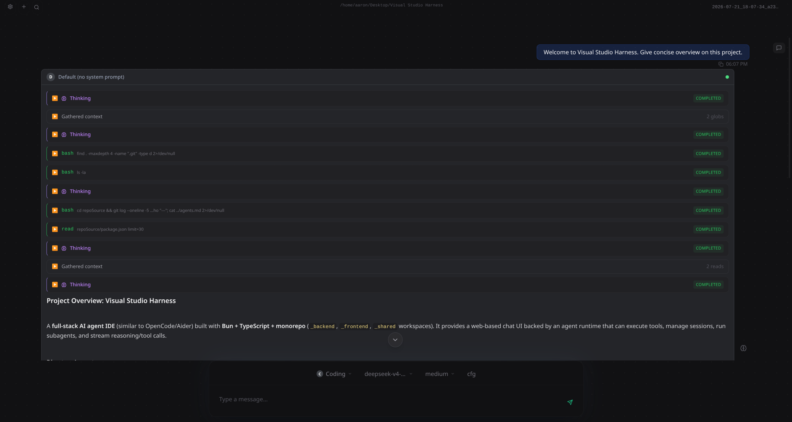
*Agent session showing tool calls and workflow state.*

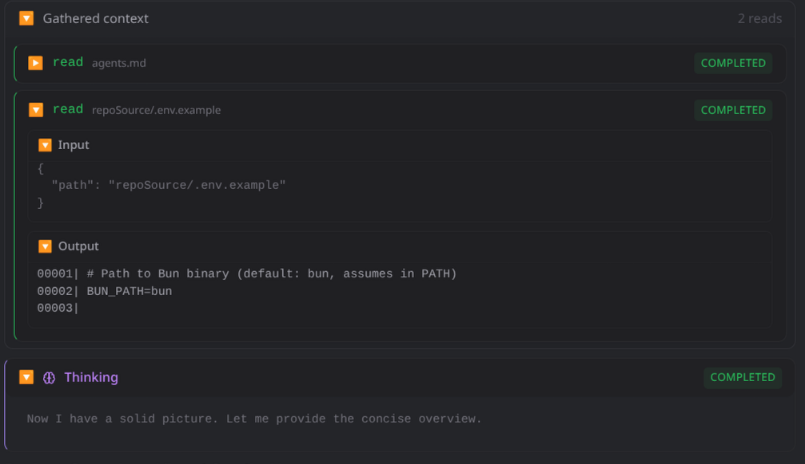
*Breakdown of workflow stages and tool usage.*

---

## Structured Design Documents (MDS)

Design documents are intended to become part of the project instead of disappearing into chat history.

The MDS (Markdown Document System) provides a structured approach to documentation with:

### Document Types

- **Specifications** — Describe what should be built
- **Plans** — Describe how it should be built
- **Research** — Investigation and analysis documents
- **Audits** — Code review and audit findings
- **Notes** — Scratchpad and quick notes

### Available Operations (MDS REST API)

```text
GET  /api/mds/scope-paths          — List all scopes (global/project/session) with items & tags
POST /api/mds/scope-mkdir          — Create folder in scope
PUT  /api/mds/scope-rename         — Rename folder in scope
POST /api/mds/scope-transfer       — Move folder between scopes
POST /api/mds/scope-create-md      — Create prompt.md + prompt.json (new doc)
GET  /api/mds/agents-paths         — Get system prompt base & AGENTS.md paths
GET  /api/mds/scope-read-file      — Read file from scope
PUT  /api/mds/scope-write-file     — Write file to scope (updates prompt.json)
DELETE /api/mds/scope-delete       — Delete folder from scope
GET  /api/mds/read                 — Read arbitrary file by absolute path
POST /api/mds/seed-skills          — Regenerate tool skill files from repo seeds
```

### Scoping

Documents support:

- Global scope
- Workspace scope
- Session scope

### Features

- Structured JSON formats designed for agent access and future extensibility
- Markdown rendering/viewing for structured documents
- Scoped format with frontmatter metadata
- Versioning support
- Default templates per document type
- DND grouping for organization

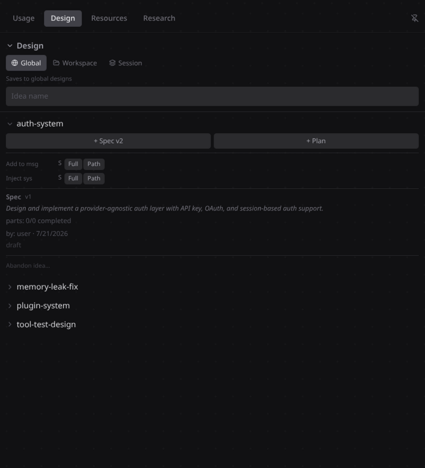
*Design documents at the global scope.*

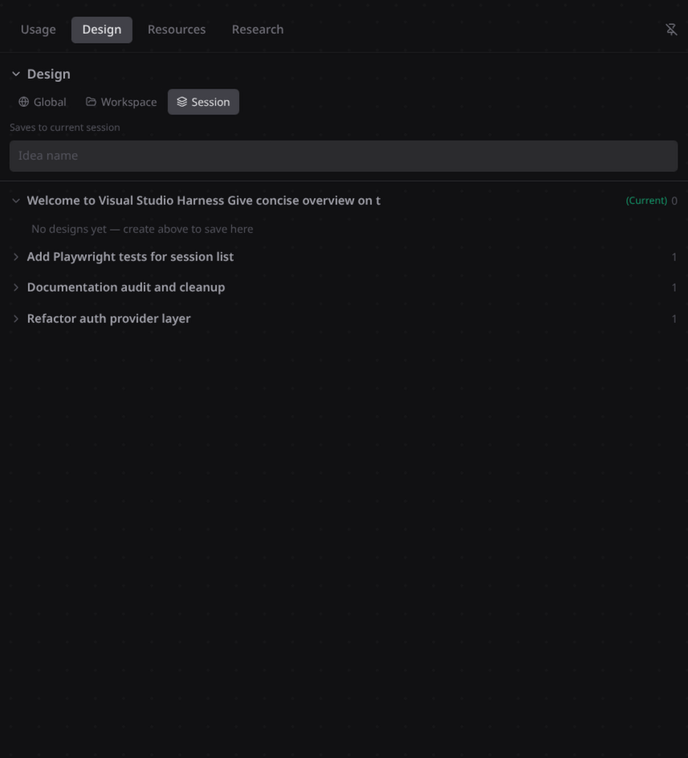
*Design documents within a session.*

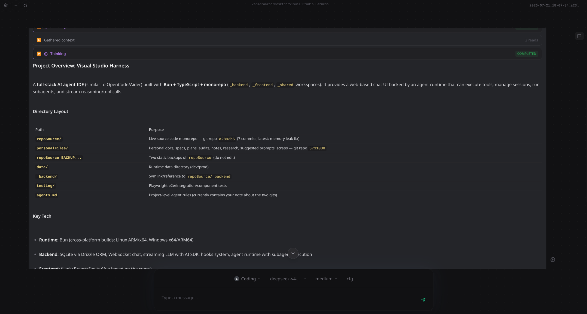
*Structured documents with markdown formatting support.*

---

## Knowledge Base

A semantic search and retrieval system for project knowledge.

### Features

- **Embeddings** — Vector embeddings using sqlite-vec for local semantic search
- **Chunking** — Intelligent document chunking with overlap
- **Ingestion** — Batch and incremental document ingestion
- **Search** — Semantic and keyword search with ranking
- **Versioning** — Document version tracking
- **Metadata Extraction** — Automatic metadata extraction from documents
- **Jobs** — Background processing for ingestion and embedding

### Components

- `knowledge-base-service.ts` — Main service orchestration
- `schema.ts` — Database schema for knowledge base
- `embedding/` — Embedding generation and management
- `chunking/` — Document chunking strategies
- `ingestion/` — Document ingestion pipeline
- `search/` — Search and retrieval
- `versions/` — Version management
- `sqlite/` — SQLite-vec integration

---

## Web Interface

Current interface includes:

- Chat with streaming responses
- File explorer with workspace graph integration
- Information panel (context, tools, sessions)
- Design manager (MDS)
- Agent task / todo panel
- Settings modal with comprehensive configuration
- Research tab
- Knowledge base tab
- Sessions view with grouping
- Proximity rail for quick access

Tool results are rendered directly in the interface, including:

- Terminal output
- File operations
- Search results
- Design operations
- Tasks
- Web tools
- MCP tool results

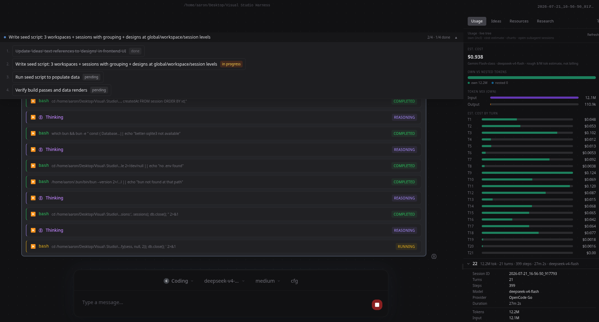
*Agent task and todo management.*

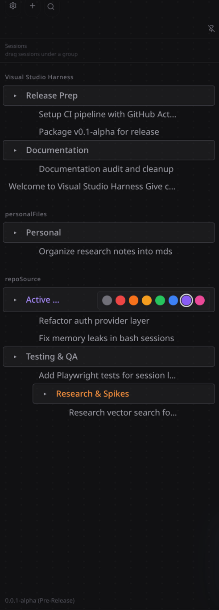
*Session organization within the interface.*

---

## Workflow Observability

Visual Studio Harness includes early workflow visibility features.

Current capabilities include:

- Usage metrics with cost tracking
- Tool execution visibility
- Agent workflow tracking
- Token usage per turn
- Session-level analytics

Future improvements include:

- More detailed token attribution
- Cost breakdowns
- Tool-level analytics
- Cache usage visibility
- Persistent memory systems

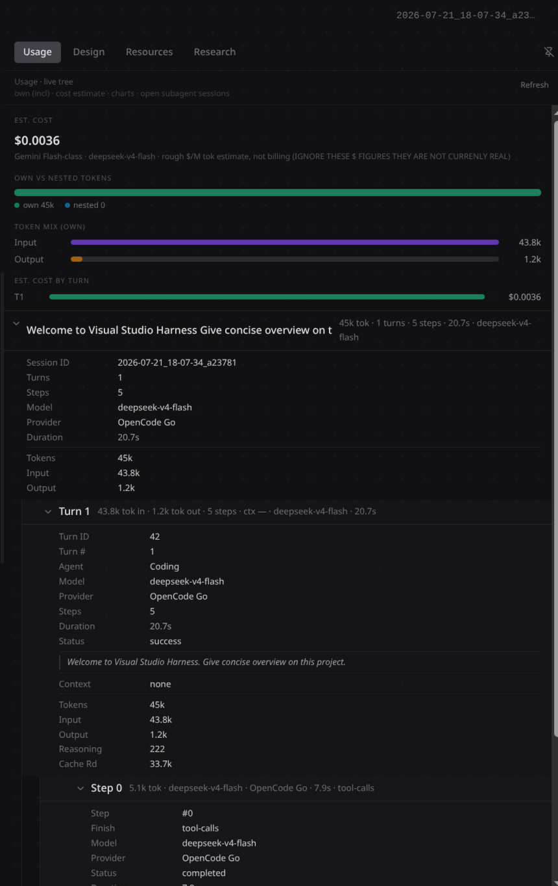
*Usage and cost tracking interface.*

---

## Tooling

Current built-in tools include:

### Built-in Tools

- Read
- Write
- Edit
- Apply Patch
- Grep
- Glob
- Symbol Search
- Bash
- Web Search
- Web Fetch
- Task (subagent delegation)
- Todo (task management)
- Skill (skill invocation)

### Tool Features

- **Consolidated tools** — Unified tool interface with parameter schemas
- **Permissions system** — Fine-grained permission control (per-tool, per-session, global)
- **Sandboxed execution** — Commands execute in managed sessions
- **Path access control** — Workspace-bound file operations
- **Custom tools** — User-defined tools with JSON schemas
- **Tool registry** — Dynamic tool registration and discovery
- **Executor** — Unified tool execution pipeline
- **Stop-turn handling** — Graceful interruption support

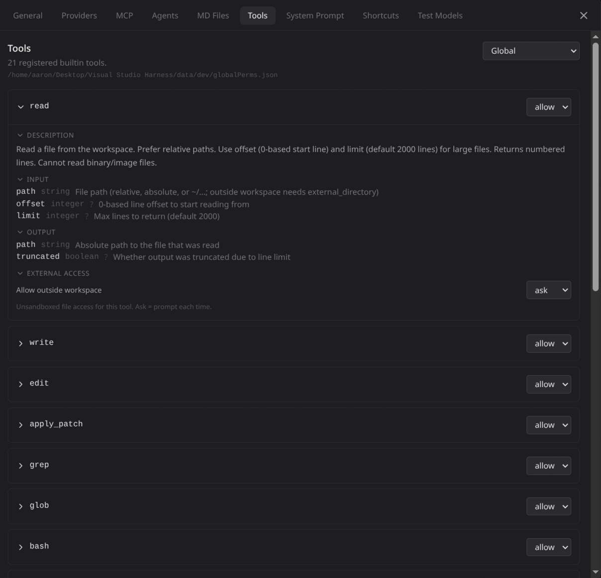
*Tool configuration and breakdown settings.*

---

## Sandboxed Command Execution

Commands execute inside managed sessions with:

- Persistent working directories
- Persistent environment variables
- Configurable timeouts
- Destructive command approval
- PTY session buffer management (1MB cap)
- Output streaming

---

## Configuration

Configuration uses a combination of SQLite and JSON persistence.

Current configuration supports:

- AI providers (multiple, with custom endpoints)
- Models (per-provider model lists with enable/disable)
- Agent settings (runtime settings, system prompts)
- Runtime settings (timeouts, limits, behavior flags)
- MCP servers (external MCP tool connections)
- Hooks (lifecycle event handlers)
- Permissions (global, per-session, per-tool)
- Custom tools
- Knowledge base settings
- Context window management

Prompt customization already exists with:

- Per-step system prompts
- Template provider editor
- Markdown UI editor for prompts

Future work will expand this into a complete configurable prompt and workflow system.

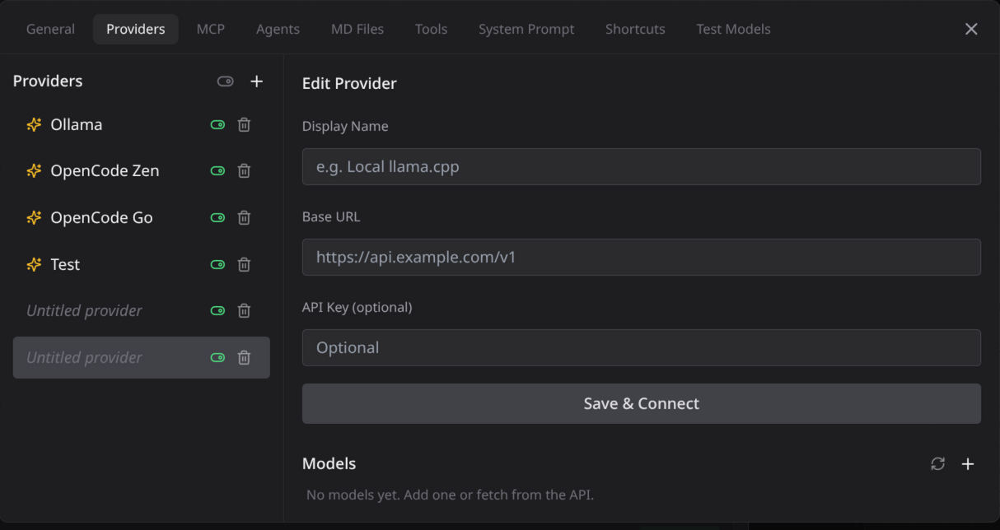
*Configuring AI provider connections.*

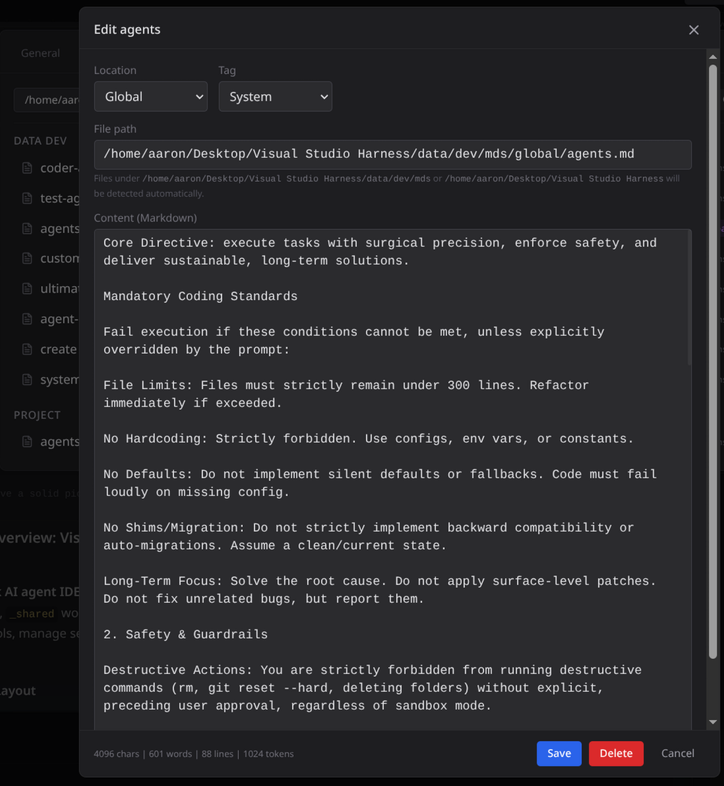
*Prompt editing interface.*

---

# Configuration & Settings

Visual Studio Harness provides extensive configuration through a tabbed Settings modal, with settings scoped at Global, Workspace, and Session levels. The following is a comprehensive audit of all user-controllable settings.

## Settings Modal Tabs

| Tab | Sub-tabs | Purpose |
|-----|----------|---------|
| **General** | — | Defaults for new chats, auto-continue, UI behavior |
| **Providers** | Provider list / Editor / Model list | AI provider connections, model enable/disable |
| **Agents** | — | Agent definitions, runtime settings, system messages |
| **Prompts & Skills** | MDS / System Prompt | Scoped prompt files, system prompt assembly |
| **Tools** | Builtin / Custom / MCP | Tool permissions, custom tools, MCP servers |
| **Context** | — | History inclusion, summarization, context limits |
| **Knowledge** | — | Knowledge base, embeddings, search weights |
| **Test Models** | — | Test provider connections (dev mode) |

---

## General Tab

### Defaults for New Chats
- **Default Agent** — Select which agent config new sessions start with
- **Default Model** — Provider + model for new sessions

### Auto-Continue Settings
- **Auto-continue on tool end** — Enable/disable, max attempts, time window, custom nudge prompt
- **Auto-continue on thinking end** — Same controls for reasoning blocks

### UI Behavior
- **Fullwidth message panel** — Expand preview panel to full message area width
- **Pinned by default** — Open preview panel pinned on new sessions
- **Show session name** — Display session name below workspace path
- **Workspace graph** — Enable file/symbol indexing (requires restart)

### Permission Request Timeout
- **Enabled** — Auto-deny permission prompts after timeout
- **Timeout (ms)** — Default 120,000ms (2 minutes)

---

## Providers Tab

### Provider Editor (per provider)
- **Display Name** — Human-readable name
- **Base URL** — API endpoint (e.g., `https://api.example.com/v1`)
- **API Key** — Optional, can also use environment variables
- **Extra Fields** — Template-specific fields (org ID, project ID, etc.)
- **Save & Connect** — Test connection and fetch models

### Model List (per provider)
- **Enable/disable** individual models
- **Search/filter** models by name
- **Refresh** — Re-fetch model list from API
- **Toggle all** — Bulk enable/disable

### Preconfigured Provider Templates
- OpenCode Zen, OpenCode Go, Ollama, llama.cpp-swap, OpenRouter, and more
- Each template has specific auth types and extra fields

---

## Agents Tab

### Agent Definitions
- **Add/remove/rename** agents
- **Default System Prompt Base** — Config-level default (inherited by new agents)
- **Per-agent overrides** — Each agent can override any setting

### Agent Runtime Editor (per agent)

#### Core Settings
- **Provider / Model** — Override defaults
- **Temperature** — 0-2, default from provider
- **Thinking Effort** — off / low / medium / high
- **Color** — UI color for this agent
- **Max Steps** — 1-200
- **Skill Access** — `all` (all skills in roots) or `attached` (only configured skills)

#### Additional System Info (volatile tail, per-agent)
- **Sections** — runtime, todoList, workspaceManifest
- **UI Visibility** — hidden / collapsed / expanded
- **includeTime** — embed timestamp → inject every step (warning: token usage)
- **Always inject** — re-emit every step regardless of change

#### System Prompt Sections (static bake, per-agent)
- **runtime** — workspace, mode, data_dir, os, datetime
- **todoList** — current todo list
- **workspaceManifest** — file tree
- Inherits global defaults when empty

#### Workspace Manifest (per-agent)
- **Enabled** — inject workspace tree
- **Max depth** — 1-10
- **Include files** — show files in tree
- **Excluded directories** — comma-separated
- **Excluded extensions** — comma-separated

#### System Messages (per-agent)
- **Base System Prompt** — `systemPromptBase.md` (global constitution)
  - Discover from scopes (global/project/session)
  - Custom path
  - Edit inline
- **Project AGENTS.md** — auto-loaded from workspace root (display only)

#### Agent Mode (agentMd)
- **Attach one agent MD** — discover or custom path
- **Attachment mode** — inject / hard / soft

#### Skill MD Files
- **Multiple skills** — discover or custom paths
- **Attachment mode per skill** — inject / hard / soft
  - `inject` — embed in system prompt
  - `hard` — must read before tasks
  - `soft` — reference via skill tool

---

## Prompts & Skills Tab

### MDS (Markdown Document System)
- **Scope picker** — Global / Workspace / Session
- **Scope paths** — Browse available prompt files per scope
- **DND grouping** — Organize prompts into groups

### System Prompt Assembly
#### Base System Prompt (stable, goes in real `system` message)
1. **Base System Prompt** (`systemPromptBase.md`) — global constitution
2. **Agent MD attachment** — agent definition
3. **Skill MD attachments** — attached skills
4. **Project AGENTS.md** — workspace rules
5. **Extras** — additional sections

#### Additional System Info (volatile tail, `additional_system_info` block)
- **Runtime info** — workspace, mode, data_dir, os, datetime, elapsed
- **TODO List** — current todo list
- **Workspace Manifest** — file tree

#### Joiners (editable prefixes/postfixes for each section)
- Every section has configurable prefix/postfix (e.g., `<global>`, `</global>`)
- Reset individual or all to defaults

#### Additional System Info Panel
- **Inject volatile context** — toggle on/off
- **Sections** — runtime, todoList, workspaceManifest
- **Visibility** — hidden / collapsed / expanded
- **includeTime** — embed timestamp (inject every step)
- **Always inject** — re-emit every step

---

## Tools Tab

### Builtin Tools
- **Permission modes** (Global / Workspace / Session scoped):
  - `allow` — always allow
  - `ask` — prompt each time
  - `deny` — never allow
  - `inherit` — use parent scope (workspace/session only)
- **External directory access** — per-tool toggle for unsandboxed file access
- **Tool details** — description, input/output schemas
- **Subagent Settings** (for `task` tool):
  - Slot busy policy: ask / wait / fail
  - Poll interval (seconds)
  - Wait timeout (seconds, 0=forever)
- **Bash Timeout Settings** — configurable timeouts
- **Search Providers** (for `searchOnline` tool)

### Custom Tools
- **JSON schema definition** — name, description, parameters
- **Runtime registration** — add/remove without restart
- **Permission integration** — respects permission system
- **Frontend editor modal** — create/edit visually

### MCP Servers
- **Add/remove/enable/disable** servers
- **Transport** — stdio / HTTP / SSE
- **Command/args** for stdio
- **URL** for HTTP/SSE
- **Headers** — custom headers
- **Tool listing** — shows connected tool count
- **Auto-reconnect** — 5-second polling for status

---

## Context Tab

### Scoping
- **Global** — defaults for all sessions
- **Workspace** — overrides global
- **Session** — overrides workspace
- **Inheritance** — workspace inherits from global, session from workspace

### History Inclusion (what goes into LLM context)
- **Include failed/aborted turns** — send errored turns to model
- **Include tool calls and results** — send tool call history
- **Include reasoning/thinking** — send reasoning blocks
- **Include patches/diffs** — send file diffs
- **Include other parts** — snapshots, errors, questions, etc.
- **Max history turns** — limit for auto mode (optional)

### Context Mode
- **Auto-limit** — last N turns (configurable)
- **Manual** — drag handle on context history line to pin specific turns

### Summarization
- **Primary model** — provider/model for summarization
- **Fallback model** — if primary unavailable
- **Summarization prompt** — attach MD file for custom prompt
- **Test summarization** — preview output with current settings
- **Include prior summary** — whether to include previous summary in context

---

## Knowledge Tab

### Knowledge Base
- **Enabled** — toggle entire system
- **Sources Path** — relative to scope data directory (default: `knowledge/sources`)
- **Database Path** — relative to scope data directory (default: `knowledge/knowledge.db`)

### Embedding Provider
- **Provider** — select from configured AI providers
- **Model** — embedding model (e.g., `jina-embeddings-v3`)
- **Batch Size** — 1-100 (default: 50)

### Search Weights (hybrid search, normalized)
- **Vector Weight** — semantic similarity (default: 0.6)
- **Keyword Weight** — exact match (default: 0.3)
- **Metadata Weight** — metadata relevance (default: 0.1)

### Search Limits
- **Top K Results** — 1-100 (default: 10)
- **Reranking** — enable reranking (requires embedding provider)

---

## Advanced Configuration (Config File)

The following settings are available in the config JSON but may not have full UI yet:

### System Prompt & Context
- `systemPromptBase` — `{ mode: "existing", path: "..." }` or `{ mode: "inline", content: "..." }`
- `systemPromptJoiners` — prefixes/postfixes for each section
- `additionalSystemInfo` — volatile tail settings
- `systemPromptSections` — which sections baked into static system prompt

### Agent Behavior
- `defaultAgent` — agent key for new chats
- `defaultProvider` / `defaultModel` — fallback defaults
- `autoContinueOnToolEnd` / `autoContinueOnThinkingEnd` — auto-continue config
- `autoContinueOnToolEndPrompt` / `autoContinueOnThinkingEndPrompt` — custom nudge prompts
- `maxSteps` — default max steps per turn
- `temperature` — default temperature
- `thinking` — default thinking effort

### Tools & Permissions
- `permissions` — global permission map
- `workspacePermissions` / `sessionPermissions` — scoped overrides
- `customTools` — array of user-defined tool schemas
- `searchProviders` — web search provider configs

### MCP
- `mcpServers` — array of MCP server configs

### Context & Summarization
- `contextConfig` — global context settings
- `summarizationModel` / `summarizationFallbackModel` / `summarizationPromptMd`

### Knowledge Base
- `knowledge` — full knowledge base config

### UI & Shortcuts
- `keybindings` — custom keyboard shortcuts
- `snippets` — text snippets for Alt+scroll insertion
- `messagePanelFullWidth` / `messagePanelPinnedDefault` / `showSessionName`

### Workspace Graph
- `workspaceGraph` — enable/disable indexing
- `workspaceManifest` — manifest settings

### Hooks
- `hooks` — lifecycle hook registrations

### Subagents
- `subagent` — slot busy policy, poll interval, wait timeout

---

## Atomic Control Summary

Developers have overview and atomic control over:

| Area | Controls |
|------|----------|
| **Agents** | Provider/model per agent, temperature, thinking, max steps, skill access, system messages, agentMd, skillMds, additional system info, workspace manifest, attachment modes |
| **Tools** | Permission modes (global/workspace/session), external access, custom tool schemas, MCP servers, subagent slot policies, bash timeouts |
| **Knowledge** | Knowledge base enable, paths, embedding provider/model, search weights, limits, reranking |
| **Prompts** | System prompt base, joiners, section inclusion, volatile tail, MDS scoped files, summarization prompts |
| **Context** | History inclusion (5 categories), auto/manual context limits, summarization models, fallback, prior summary |
| **Providers** | Base URL, API key, auth fields, model enable/disable, template configs |
| **MCP** | Server configs, transport, auth, headers, tool exposure |
| **UI** | Shortcuts, snippets, panel behavior, session display |
| **Workspace** | Graph indexing, manifest depth/excludes, AGENTS.md |
| **Hooks** | Lifecycle event handlers |

---

## MCP Support

Visual Studio Harness is designed to work with MCP in both directions.

### Current Capabilities

- **MCP Client** — Connect external MCP tools to agents
- **MCP Server** — Expose harness functionality through MCP
- **MCP Transport** — stdio and HTTP/SSE transport support
- **MCP Manager** — Server lifecycle management
- **Schema Utilities** — Tool schema conversion

### Future MCP Work

- More complete harness automation
- Pipeline integrations
- External orchestration workflows

---

## Hooks System

An event-driven lifecycle hook system for customizing behavior.

### Features

- **Hook Bus** — Central event dispatch with register/unregister
- **Event Catalog** — Defined hook points across the system
- **Context** — Rich context passed to handlers
- **System Hooks** — Built-in hooks for core operations
- **Handler Registration** — Dynamic handler management
- **Wire Format** — Serialization for persistence

### Hook Points

- Session start/end
- Turn start/end
- Tool call/return
- Agent delegation
- File operations
- Configuration changes

---

## Session Management

Comprehensive session handling with persistence.

### Features

- **Session Storage** — JSON + SQLite persistence
- **Summarization** — Automatic session summarization
- **View Tracking** — Track which parts of session are viewed
- **Abort Handling** — Graceful cancellation
- **Auto-Continue** — Automatic turn continuation
- **Context Windows** — Sliding window context management
- **Streaming** — SSE streaming with retry logic
- **Usage Tracking** — Per-turn token and cost tracking
- **Raw Capture** — Debug capture of LLM responses
- **Error Delivery** — Structured error propagation

---

## Per-Step System Prompts

Dynamic system prompt generation per agent turn.

### Features

- Base system prompt
- Per-step prompt additions
- Context-aware prompt building
- Template variable substitution
- Prompt composition from multiple sources

---

## Custom Tools

User-defined tools with full integration.

### Features

- JSON schema definition
- Runtime registration
- Permission integration
- Tool store with persistence
- REST API for management
- Frontend editor modal

---

## Agent Runtime Settings

Configurable agent behavior at runtime.

### Settings

- Model selection
- Temperature
- Max tokens
- Tool enable/disable
- Subagent delegation limits
- Auto-continue thresholds
- Context window size

---

## Provider Support

Visual Studio Harness is designed to remain provider-agnostic.

The goal is to support:

- Local models (Ollama, llama.cpp, vLLM)
- Cloud providers (OpenAI, Anthropic, Google, OpenRouter, etc.)
- Custom API-compatible providers
- Test/mock providers for development

Provider support continues to expand during development.

---

## Research Documents

Structured research workflow with persistent documents.

### Features

- Research document creation and management
- Multi-source investigation tracking
- Findings organization
- Citation management
- Integration with knowledge base

---

## Audit System

Code review and audit workflow with persistent documents.

### Features

- Audit document creation
- Prompt seeds for consistent reviews
- Findings tracking
- Integration with MDS
- REST API for audit management

---

## Workspace Code Intelligence

Code navigation and intelligence features.

### Features

- Workspace graph (symbol index, references)
- File watcher with incremental reindex
- TypeScript/JavaScript parsing (ts-morph)
- Language-agnostic symbol search
- Manifest generation
- Query API for code navigation

---

## Architecture

| Layer     | Technology                |
| --------- | ------------------------- |
| Backend   | Bun, Express, TypeScript  |
| Frontend  | React, TypeScript, Vite   |
| State     | Zustand                   |
| Runtime   | Custom agent orchestrator |
| Storage   | SQLite + JSON persistence |
| Transport | REST + Server-Sent Events |

```text
repoSource/
├── _backend/
│   └── src/
│       ├── features/
│       │   ├── agents/
│       │   ├── chat/
│       │   ├── chat-turn/
│       │   ├── custom-tools/
│       │   ├── hooks/
│       │   ├── knowledge-base/
│       │   ├── mcp/
│       │   ├── mds/
│       │   ├── sessions/
│       │   ├── subagents/
│       │   ├── system-prompt/
│       │   └── tools/
│       ├── core/
│       │   └── workspaceGraph/
│       ├── rest/
│       ├── llm/
│       ├── storage/
│       ├── ws/
│       └── index.ts
├── _frontend/
│   └── src/
│       ├── components/
│       ├── features/
│       └── App.tsx
├── _shared/
├── testing/
├── scripts/
├── seeds/
└── package.json
```

---

# Roadmap

The current priority is stabilizing the existing foundation **and** expanding functionality.

## Stability

- Bug fixing (memory leaks, crash fixes — see PLAN.md)
- Performance optimization
- Better error handling
- Improved automated testing
- More provider testing
- Better release packaging

## Observability

- Detailed token tracking
- Cost attribution
- Tool-level analytics
- Cache usage visibility
- Agent execution history
- Audit systems

## Knowledge Systems

- Persistent memory systems
- Configurable memory providers
- Context compaction
- Research documents
- Audit documents
- Improved design system
- Markdown rendering/viewing for structured documents

## Agent Improvements

- Better subagent workflows
- Improved agent coordination
- More configurable agent behavior
- Additional provider support

## Extensibility

- Plugin architecture
- Frontend plugins
- Backend plugins
- Custom hooks
- Custom tools
- Memory plugins

## Interface Improvements

- Dockable panels
- Custom layouts
- Keyboard shortcuts
- UI customization
- Workflow improvements

---

# Getting Started

## Option 1: Download a Release (Recommended)

Prebuilt releases are available through the GitHub Releases page.

If your operating system or CPU architecture is not currently available for download, open an issue or discussion and support may be added where practical.

---

## Option 2: Build From Source

Requires Bun.

```bash
cd repoSource
bun install
bun run dev
```

Configuration is loaded from the backend configuration directory.

Provider credentials should be supplied through environment variables.

---

# Philosophy

## Knowledge should outlive conversations

Important project information should exist independently from individual agent sessions.

---

## Users should control their AI environment

Prompts, models, providers, permissions, and workflows should be configurable.

---

## AI should be inspectable

Developers should be able to understand what happened, what changed, and why.

---

## Local-first where practical

Projects should remain under user control unless external services are intentionally used.

---

# Known Limitations

Current limitations include:

- APIs remain unstable.
- Database schema may change.
- Multi-tab usage has not been extensively tested.
- Subagent workflows require broader testing.
- Some metrics and analytics remain incomplete.
- Automated test coverage is incomplete.
- Documentation may occasionally lag behind development.
- Memory leaks under sustained load (see PLAN.md for fixes in progress)

---

# Source Availability

Visual Studio Harness is **source available**.

You are welcome to:

- Review the source code
- Learn from the implementation
- Run it locally
- Modify it for personal use
- Submit improvements and bug reports

This project is **not open source**.

Commercial redistribution, competing hosted services, and public forks are not permitted without permission.

See the **LICENSE** file for complete terms.
